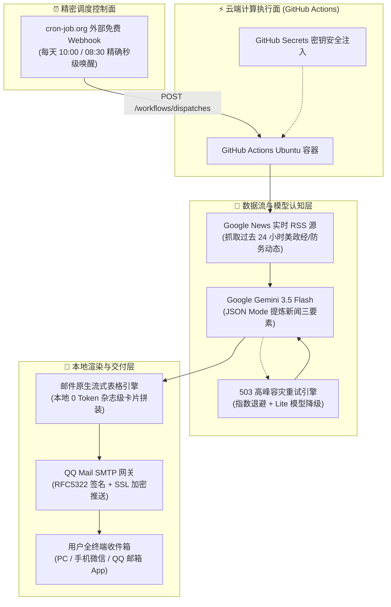

<div align="center">

# 📰 华盛顿观察 · 每日要闻简报
### Washington Intelligence Briefing

**基于 Google Gemini 3.5、实时 RSS 与外部 Webhook 精密调度的无服务器全自动外媒晨报系统**

[](https://www.python.org/)
[](https://ai.google.dev/)
[](https://github.com/features/actions)
[](https://cron-job.org/)
[](https://github.com/)
[](LICENSE)

<br/>

*让客观的全球一手资讯，每天早晨准时以高颜值杂志级卡片呈现于你的收件箱。*

</div>

---

## 💡 产品设计哲学与亮点

本项目是个人微型 AI 产品（AI Micro-Product）的完整工程实践，核心贯彻**“动静解耦、确定性工程护航不确定性大模型”**的架构设计：

* 🌐 **实时零成本信源接入**：摆脱商业大模型昂贵的原生联网费用与信用卡绑定门槛，直接通过标准库拉取海外主流媒体（WSJ, Reuters, Bloomberg, AP 等）过去 24 小时的实时 RSS 资讯，信息保真度 100%。
* 🤖 **JSON Mode 结构化语义提炼**：深度调校提示词工程，强制 Gemini 3.5 Flash 输出纯净 JSON，严格提炼**“背景、经过、影响”新闻三要素**，杜绝排版漂移与模型幻觉。
* 🎨 **本地 0 Token 杂志风卡片渲染**：AI 专注文本创作，本地 Python 引擎负责视觉渲染。采用邮件行业标准的**原生流式表格（Table-based Layout）**与内联 CSS，攻克移动端与 QQ/Foxmail 客户端对 Flexbox 的清洗过滤，实现 100% 跨端像素级保真。
* ⏱️ **“控制面与执行面分离”的高可靠调度**：采用 `cron-job.org` 外部专职 Webhook 闹钟精准触发 GitHub Actions 免费算力容器，彻底解决公有云 CI/CD 调度器在早高峰排队延时（或休眠不触发）的业界通病。
* 🛡️ **生产级高可用容灾与隐私安全**：
  * **503 瞬时过载自愈**：内置指数退避重试（Exponential Backoff）与轻量模型容灾降级；
  * **合规邮件防伪认证**：严格封装 RFC5322 发件人规范，轻松绕过严格反垃圾网关；
  * **敏感数据全生命周期隔离**：全量环境变量注入，Git 提交历史审计与日志打印脱敏。

---

## 🏗️ 系统全栈架构图 (Architecture)



---

## 🎨 视觉排版展示 (Newsletter Visuals)

邮件正文抛弃了传统枯燥的纯文本，采用**华盛顿智库内参风格**，包含：
1. **深色权威刊头**：动态日期、智库期数徽标与来源交叉验证说明；
2. **主题分类色系**：国内政经（经典商务蓝 `#2563eb`）与外交防务（稳重墨绿 `#059669`）；
3. **标签胶囊式三要素结构**：
   - 📌 背景：交代事件起因与历史上下文；
   - ⚡ 经过：核心动态、博弈细节与最新进展；
   - 📊 影响：战略结论、金融市场或国际地缘走势；
4. **信源胶囊**：媒体出处（如 Reuters、Bloomberg）与直达原始报道的超链接。

---

## 🚀 快速上手部署

### 1. 配置 GitHub Secrets
进入你的 GitHub 仓库 Settings -> Secrets and variables -> Actions -> New repository secret，添加以下 4 个密钥：

| Secret 变量名 | 说明 | 示例 |
| :--- | :--- | :--- |
| `GEMINI_API_KEY` | Google AI Studio 免费申请的 API 密钥 | `AIzaSy...` |
| `SMTP_SENDER` | 发件邮箱（QQ 邮箱） | `12345678@qq.com` |
| `SMTP_AUTH_CODE` | QQ 邮箱设置中生成的 16 位 SMTP 授权码 | `abcdefghijklmnop` |
| `SMTP_RECEIVER` | 晨报接收邮箱（可与发件邮箱相同） | `xxx@foxmail.com` |

---

### 2. 配置秒级准时外部 Webhook（推荐方式）

为避免 GitHub 内部定时任务在公有云高峰期的排队延迟，推荐使用免费的 [cron-job.org](https://cron-job.org/) 作为调度闹钟：

1. **生成 GitHub Token**：
   - GitHub 头像 Settings -> Developer settings -> Personal access tokens (classic)；
   - 创建一个勾选了 `repo` 权限的 Token 并复制；
2. **在 cron-job.org 创建任务**：
   - **URL**: `https://api.github.com/repos/你的用户名/仓库名/actions/workflows/daily_report.yml/dispatches`
   - **Schedule**: 时区选择 `Asia/Shanghai (UTC+8)`，时间设为你期望的推送时刻（如每天 `08:30` 或 `10:00`）；
   - **Request Method**: `POST`
   - **Request Body**: `{"ref": "main"}`
   - **Headers**:
     - `Authorization`: `Bearer 你的GitHub_Token`
     - `Accept`: `application/vnd.github.v3+json`
     - `User-Agent`: `cron-job-org`

---

## 🛠️ 本地开发与调试

```bash
# 1. 克隆仓库
git clone https://github.com/你的用户名/仓库名.git
cd 仓库名

# 2. 安装依赖
pip install -r requirements.txt

# 3. 注入测试环境变量 (PowerShell 为例)
$env:GEMINI_API_KEY="你的Key"
$env:SMTP_SENDER="your_qq@qq.com"
$env:SMTP_AUTH_CODE="your_code"
$env:SMTP_RECEIVER="your_receive@qq.com"

# 4. 执行晨报抓取与发送
python main.py
```

---

## 📝 独立产品制作者技术手记 (Maker's Retrospective)

> “打造一个实用的 AI Agent 或自动化产品，调用大模型 API 仅仅完成了最显性化的前 20% 工作；剩下 80% 的护城河在于网络协议、反垃圾策略、容灾降级韧性以及跨终端视觉兼容性的工程打磨。”

1. **不要让大模型做它不擅长的事**：
   大模型擅长发散、理解与总结，但不擅长输出长篇复杂的确定性格式。让大模型直接写 HTML 不仅浪费 80% 的 Token，还极易发生标签截断。采用“纯净 JSON 交付 + 本地模板拼装”，是构建工业级 AI 应用的基石。
2. **控制面与执行面的解耦**：
   公有云 CI/CD 机器性能强大且免费，但其调度器并不适合精准定时；专职 Webhook 调度器定时极准，但无法执行重型算力。将两者以 API 解耦连接，用最合适的基础设施做最合适的事。
3. **安全即生命线**：
   从第一天起就坚持“代码与配置彻底分离”，所有凭据走环境变量并严格审查 Git 历史，确保项目随时具备安全开源的底气。

---

## 📄 License

本项目基于 MIT 许可证开源，欢迎自由 Fork、优化与定制属于你自己的每日资讯机器人！
